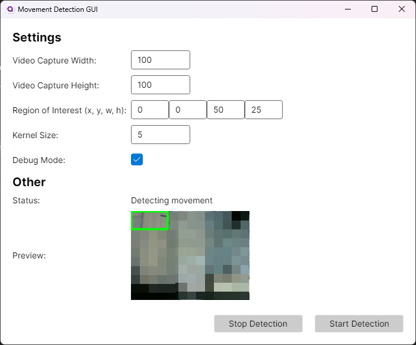

# Webcam movement detection GUI

<h3>An app that detects movement on your connected camera and allows you to define custom actions to perform when movement is detected. By default it presses Ctrl+Win+RightArrow to switch to the next desktop.</h3>

   

Why this thing is worth something:    
 - Has a nice GUI
 - You can define your region of interest
 - Works with light changes (sort of)
 - Works 110% of the time
 - Performant, uses 1-3% of CPU and 60 mb of RAM

## What do the settings do?
- Video capture width/height: Configure the size of captured frame for performance benefits. Usually unsupported by webcams.
- Region of interest: Define a region where the program will detect movement.
- Kernel size: Smaller values provide more detail but more noise, higher values provide less noise but less detail. Recommended in the range of 1-10.
- Blur strength: Higher values filter out more small movements and noise. Set to higher value if the app triggers from seemingly no changes in the region of interest.
- Debug mode: If enabled beeps instead of executing defined action from `DoAfterDetection` function

## How do I change the action when movement is detected?

1. Download contents of the repo using the big green button `<> Code`
2. Open the file `MainWindow.axaml.cs` in Views folder
3. Edit function DoAfterDetection to do what you want
4. Build the app
