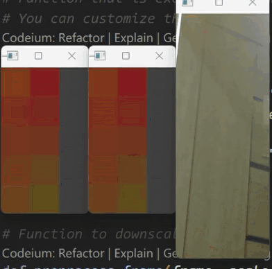

# Webcam movement detection

<h3>A python script that executes custom actions when movement is detected on your connected camera.    
 By default, it presses Ctrl+Win+RightArrow to switch to the next desktop.</h3>

   

## Features:    
 - Region of interest
 - Adaptation to light changes
 - Works 110% of the time
 - Performant, uses 0-1% of CPU and 40 mb of RAM

## How to run

1. Download [Python](https://www.python.org/)
2. Download the file `main.py`
3. Install the `pyautogui` library for hotkey support using `pip install pyautogui` in the console.
4. Set the `debug` variable to `True` in the main.py file.
4. Run the script with `python main.py` in the console.
5. Adjust the settings in the main.py file through trial and error to suit your use case.
6. Set `debug` to `False` and run again    
You can modify the `on_movement_detected()` function to customize actions upon movement detection.
If issues arise, experiment with different settings.

## How it works
Here is the algorithm:
1. Capture the image from a webcam
2. Downscale the image to eliminate some noise
3. Convert to hsv and remove brightness information
4. Compare the hues of the processed image to the previous frame's hues
5. If the difference exceeds the threshold, motion is present
